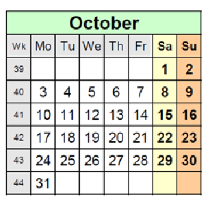

# Calendrical

#### By Sydney Cardew

This program was written to satisfy the following coding interview question 
that was sent to me by a friend:

---

  ### ETAS Coding Exercise
  Write a HTML calendar generator in a programming language of your choice
  
  Requirements:    
1. It should be a command line tool.    
2. Output of the generator shall be a static HTML page.   
3. The year should be taken as a command line option.    
4. Name of the generated file shall be taken as a command line option.    
5. We assume usage of the Gregorian calendar      
    * https://en.wikipedia.org/wiki/Gregorian_calendar     
    * Earliest supported date: October 1582    
6. Calendar shall be generated for: Year – 1, then Year and then Year + 1
    a. i.e. if a year is 2016 then generation should happen for 2015, 2016 and 2017
7. Calendar shall have a following format for a month:

    
    
8. Week days are mandatory.
9. Week numbers are optional.
10. The overall format of the calendar is up to you.
11. Usage of time / calendar-related libraries is forbidden.
12. Generate example calendars for the following dates:
    * 1800
    * 1900
    * 2000
    * 2017
13. Send the generated HTML for the example calendars and the source code to us.

---

### Methodology and notes:

I tend to approach problems like this in stages after producing a brief outline. My first
task was to create something which could replace the utility provided by Python date objects
(which I would use to create a program such as this in a professional setting). The resulting 
Year class ended up being somewhat over-engineered by dint of the way that I was testing it. At
its core, it works by counting the days and week cycles from October 15th 1582 (when the
Gregorian calendar began):

```python3
leap_years_since_1582 = (i for i in range(1583, self.year) if i % 4 == 0 and i % 100 != 0 or i % 400 == 0)
days_to_year_start = ((year - 1582) * 365) + len(list(leap_years_since_1582)) + 78
self.jan_one_day = (days_to_year_start % 7) - 1
```

It then constructs the rest of the Year object and the 12 Month objects associated with it. The
Month objects contain the actual information that is fed into the html generator and render
some of the features of the Year object ultimately redundant; for example, the ability of the
year object to return the day of the week of any date when passed `Year(<year>).months[month].days[day]`.

Once these objects were working properly, I went on to the html. I began the design of the sheet
on codepen.io, then moved to my own text editor to refine it.

https://codepen.io/sydneycardew/pen/PoRPMWq

Once I was happy with what I had I needed to transform it into code. I opted to write the html
straight to a file rather than using `yattag` or a similar library, since it made the process
of porting it over from my template quicker. The generator could be pared down to a much further extent, if I decide
to work on the project further.